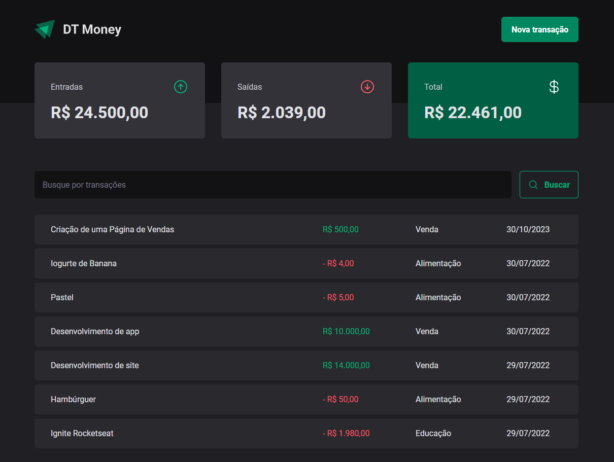

# Ignite - 03 - Consumo de API e performance no ReactJS

<p align="center">
  <a href="#sobre">Sobre</a> •  
  <a href="#instalação">Instalação</a> •
  <a href="#tecnologias">Tecnologias</a> •
  <a href="#autor">Autor</a>  
</p>



## Sobre

Esta é uma aplicação React utilizando o Vite e implementada no módulo 3 do curso Ignite - Trilha React (Rocketseat) onde será ensinado como se conectar a uma API json-server utilizando o fetch e o Axios. Também será abordado alguns tópicos sobre performance.

<a href="https://www.figma.com/community/file/1138814493269096792/dt-money" target="_blank">
Layout do projeto
</a>


## Instalação

Antes de começar, você vai precisar ter instalado em sua máquina as seguintes ferramentas:
[Git](https://git-scm.com), [Node.js](https://nodejs.org/en/).
Além disso é bom ter um editor para trabalhar com o código como [VSCode](https://code.visualstudio.com/).

### 🎲 Rodando o Back End (servidor)

```bash
# Clone este repositório
$ git@github.com:kadoshmt/ignite-reactjs-course.git

# Acesse a pasta do projeto no terminal/cmd
$ cd ignite-reactjs-course/03-dt-money

# Instale as dependências
$ npm install
# Caso prefira usar o Yarn execute o comando abaixo
$ yarn install

# Execute os testes da aplicação com o comando  abaixo
$ npm run test
```

## Tecnologias

[](https://skillicons.dev)

## Autor

<div align="center">

<h1>Janes Roberto</h1>
<strong>Backend/Frontend Developer</strong>
<br/>
<br/>

<a href="https://www.linkedin.com/in/janes-roberto-da-costa/" target="_blank">

</a>

<a href="https://github.com/kadoshmt" target="_blank">

</a>
<br/>
<br/>
</div>