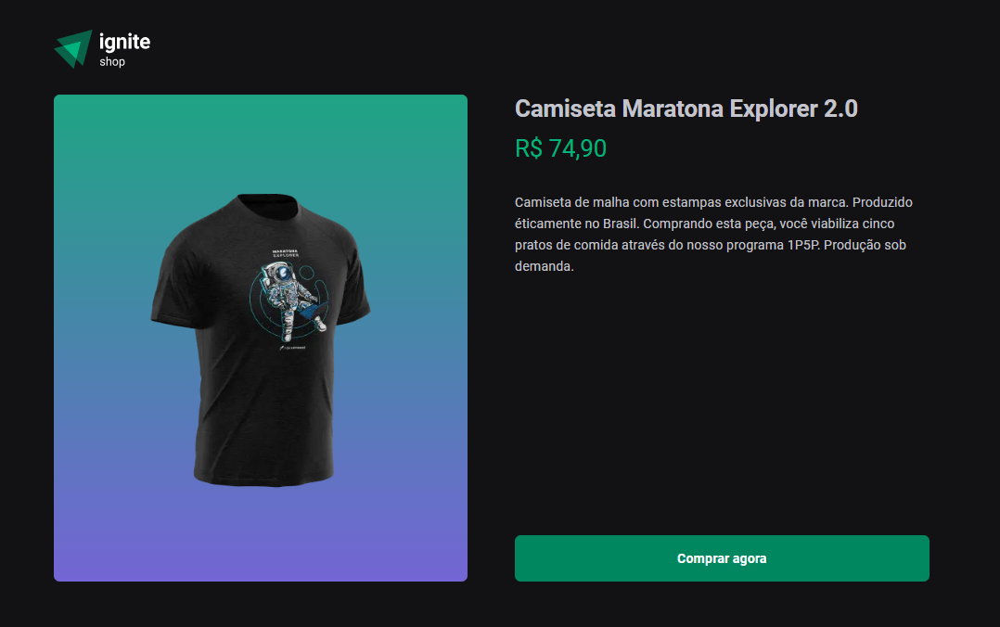

# Ignite - 04 - Fundamentos do NextJS

<p align="center">
  <a href="#sobre">Sobre</a> •  
  <a href="#instalação">Instalação</a> •
  <a href="#tecnologias">Tecnologias</a> •
  <a href="#autor">Autor</a>  
</p>



## Sobre

Nesse módulo criaremos um projeto completo com o framework Next.js. Vamos utilizar StitchesJS, passando por conceitos de SPA, server-side rendering (SSR) e static-site generation (SSG).

<a href="https://www.figma.com/file/1H6meUOTJmuFmoBTdmaASE/Ignite-Shop-%E2%80%A2-Projeto-React-Copy?fuid=815308948269810973" target="_blank">
Layout do projeto
</a>


## Instalação

Antes de começar, você vai precisar ter instalado em sua máquina as seguintes ferramentas:
[Git](https://git-scm.com), [Node.js](https://nodejs.org/en/).
Além disso é bom ter um editor para trabalhar com o código como [VSCode](https://code.visualstudio.com/).

### 🎲 Rodando o Back End (servidor)

```bash
# Clone este repositório
$ git@github.com:kadoshmt/ignite-reactjs-course.git

# Acesse a pasta do projeto no terminal/cmd
$ cd ignite-reactjs-course/04-ignite-shop

# Instale as dependências
$ pnpm install
# Caso prefira usar o Yarn ou npm execute o comando abaixo
$ yarn install
$ npm install
```

## Tecnologias

[](https://skillicons.dev)

## Autor

<div align="center">

<h1>Janes Roberto</h1>
<strong>Backend/Frontend Developer</strong>
<br/>
<br/>

<a href="https://www.linkedin.com/in/janes-roberto-da-costa/" target="_blank">

</a>

<a href="https://github.com/kadoshmt" target="_blank">

</a>
<br/>
<br/>
</div>