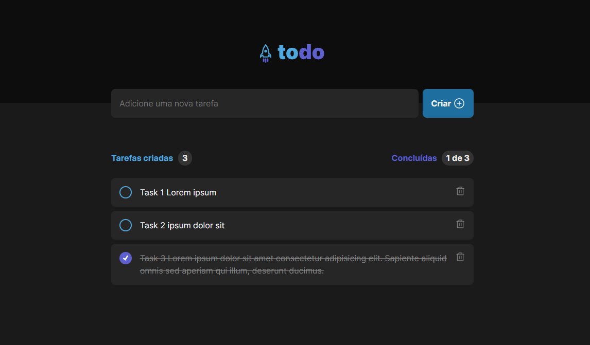

# Ignite - Desafio 1 - App ToDo

<p align="center">
  <a href="#sobre">Sobre</a> •  
  <a href="#instalação">Instalação</a> •
  <a href="#tecnologias">Tecnologias</a> •
  <a href="#autor">Autor</a>  
</p>



## Sobre

Nesse desafio, foi desenvolvido uma aplicação de controle de tarefas no estilo **to-do list**, que contém as seguintes funcionalidades:

- Adicionar uma nova tarefa
- Marcar e desmarcar uma tarefa como concluída
- Remover uma tarefa da listagem
- Mostrar o progresso de conclusão das tarefas

Apesar de serem poucas funcionalidades, a ideia deste desafio foi relembrar conceitos como:

- Estados
- Imutabilidade do estado
- Listas e chaves no ReactJS
- Propriedades
- Componentização


## Instalação

Antes de começar, você vai precisar ter instalado em sua máquina as seguintes ferramentas:
[Git](https://git-scm.com), [Node.js](https://nodejs.org/en/).
Além disso é bom ter um editor para trabalhar com o código como [VSCode](https://code.visualstudio.com/).

### 🎲 Rodando o Back End (servidor)

```bash
# Clone este repositório
$ git@github.com:kadoshmt/ignite-reactjs-course.git

# Acesse a pasta do projeto no terminal/cmd
$ cd ignite-reactjs-course/desafio-01-fundamentos-reactjs

# Instale as dependências
$ npm install
# Caso prefira usar o Yarn execute o comando abaixo
$ yarn install

# Execute os testes da aplicação com o comando  abaixo
$ npm run test
```

## Tecnologias

[](https://skillicons.dev)

## Autor

<div align="center">

<h1>Janes Roberto</h1>
<strong>Backend/Frontend Developer</strong>
<br/>
<br/>

<a href="https://www.linkedin.com/in/janes-roberto-da-costa/" target="_blank">

</a>

<a href="https://github.com/kadoshmt" target="_blank">

</a>
<br/>
<br/>
</div>