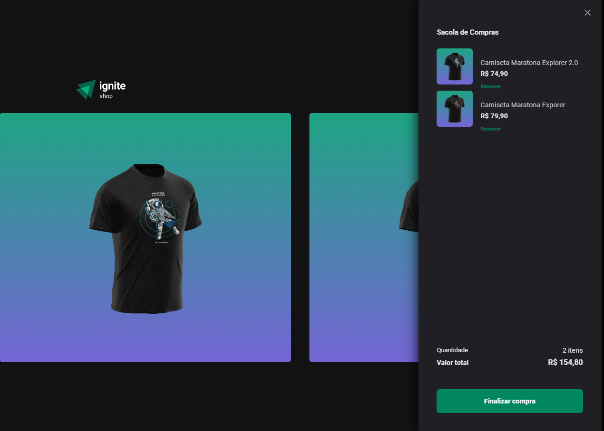

# Ignite - Desafio 4 - Ignite Shop 2.0

<p align="center">
  <a href="#sobre">Sobre</a> •  
  <a href="#instalação">Instalação</a> •
  <a href="#tecnologias">Tecnologias</a> •
  <a href="#autor">Autor</a>  
</p>



## Sobre

Nesse desafio, foi implementado um carrinho no projeto 04 (Ignite Shop), com a opção de adicionar e remover os itens antes de prosseguir ao checkout utilizando a API do Stripe, que contém as seguintes funcionalidades:

- Utilizar a listagem já criada pela aplicação, mas com a possibilidade de adicionar aquele item ao carrinho na página do produto.
- Salvar todos os itens selecionados na aplicação, e exibir o número de itens no carrinho
- Enviar o carrinho que armazenado na aplicação para a rota de checkout, onde irá gerar a sessão de checkout com os ``line_items`` necessários.


 As informações sobre este desafio podem ser encontradas <a href="https://efficient-sloth-d85.notion.site/Desafio-04-Adicionando-features-ao-Ignite-Shop-91e5b2c26c9342f5b1375ba66907d0b7" target="_blank">neste link</a>.

## Instalação

Antes de começar, você vai precisar ter instalado em sua máquina as seguintes ferramentas:
[Git](https://git-scm.com), [Node.js](https://nodejs.org/en/).
Além disso é bom ter um editor para trabalhar com o código como [VSCode](https://code.visualstudio.com/).

### 🎲 Rodando o aplicação

```bash
# Clone este repositório
$ git@github.com:kadoshmt/ignite-reactjs-course.git

# Acesse a pasta do projeto no terminal/cmd
$ cd ignite-reactjs-course/desafio-03-github-blog

# Instale as dependências
$ pnpm install
# Caso prefira usar o Yarn execute o comando abaixo
$ yarn install

# Execute os testes da aplicação com o comando  abaixo
$ pnpm run dev
```

## Tecnologias

[](https://skillicons.dev)

## Autor

<div align="center">

<h1>Janes Roberto</h1>
<strong>Backend/Frontend Developer</strong>
<br/>
<br/>

<a href="https://www.linkedin.com/in/janes-roberto-da-costa/" target="_blank">

</a>

<a href="https://github.com/kadoshmt" target="_blank">

</a>
<br/>
<br/>
</div>